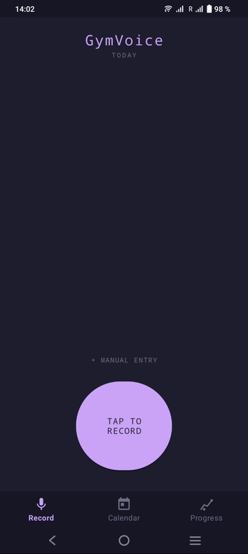

# GymVoice

Offline Android workout logger. Speak your set, GymVoice logs it — no internet, no cloud, no subscriptions.

```
"bench press 3 sets 8 reps 80 kilos"  →  ✓ Logged
```



## How it works

```
Mic → Android STT → Gemma 3 (NLP) → Room DB
```

All inference runs on-device. Your data stays on your phone.

## Features

- **Voice logging** — speak naturally, app parses exercise, sets, reps, weight
- **Manual entry** — tap to log without speaking
- **Clone** — repeat a set in one tap from the edit dialog
- **Progress tab** — sparkline chart, PR tracking, weight/reps/volume modes
- **Correction learning** — fix a misheard name once, remembered forever
- **Past-date logging** — log missed sessions via calendar picker

## Requirements

- Android 10+
- ~300 MB free storage (Gemma model)
- Gemma 3 270M INT8 model (pushed via adb)

## Setup

```bash
# 1. Generate Gradle wrapper (first time only)
./bootstrap.sh

# 2. Push Gemma model to device
make push-model

# 3. Build and install
make flash
```

## Dev commands

| Command | Action |
|---------|--------|
| `make build` | assemble APK |
| `make flash` | build + install |
| `make format` | ktlint autofix |
| `make check` | ktlint verify |
| `make lint` | detekt |
| `make pre-commit` | format + lint + build |
| `make push-model` | adb push Gemma model |
| `make clean` | gradle clean |

See [CLAUDE.md](CLAUDE.md) for full architecture details.

## Tech stack

| Layer | Library |
|-------|---------|
| STT | Android SpeechRecognizer (on-device) |
| NLP | Gemma 3 270M via LiteRT-LM 0.10.2 |
| DB | Room 2.6 |
| UI | ViewBinding, RecyclerView, Material 3 |
| Theme | Catppuccin Mocha |
